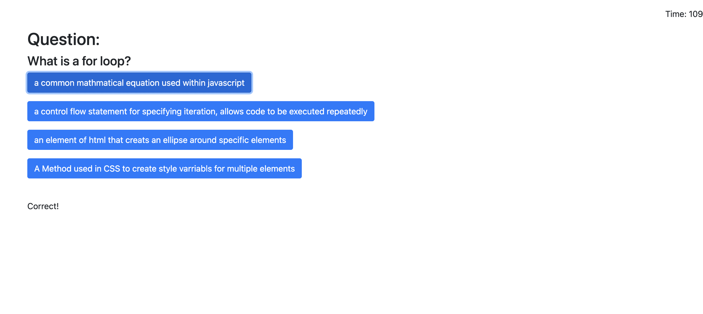
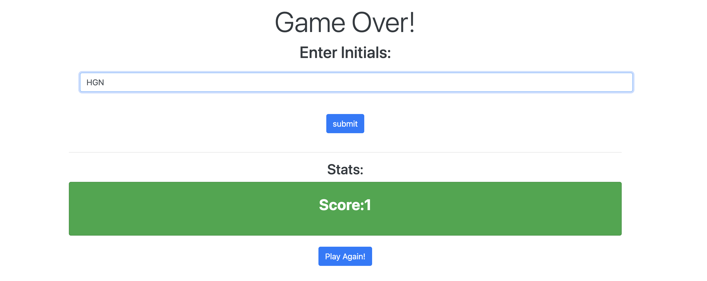

# Javascript Code Quiz 📚
[](https://opensource.org/licenses/)
#### **Name:** Honore Nelson
#### **Deployed Link:** https://matisses-goldfish.github.io/javascript-quiz/
#### **Github Repo:** https://github.com/matisses-goldfish/javascript-quiz
---
    
##  Table of Contents:
* [Description](#description)
* [Acceptance Criteria](#acceptance-criteria)
* [Demo](#demo)
* [Installation](#installation)
* [Usage Information](#usage)
* [Testing Instructions](#testing)
* [Authors](#authors)
* [License](#license)
* [Question](#questions)
* [Source](#source)


## Description
---
This front-end application employs extensive javacript to test the users knowledge of the coding basics. The quiz is timed, and allows the user to enter and save their score to the Stats Board. 

## Acceptance Criteria
```
GIVEN I am taking a code quiz
WHEN I click the start button
THEN a timer starts and I am presented with a question
WHEN I answer a question
THEN I am presented with another question
WHEN I answer a question incorrectly
THEN time is subtracted from the clock
WHEN all questions are answered or the timer reaches 0
THEN the game is over
```
## Future Development
---
```
WHEN the game is over
THEN I can save my initials and my score
```
## Demo
---





## Usage
---
Begin the applicant by clicking on the deployed link above.

## Contribution Guidelines
---
Contribute using the github workflow model
    
    
## Authors
---
* **Honore Nelson** - *Initial work* - [Javascript Quiz](https://github.com/matisses-goldfish/javascript-quiz)
    
## License
---

This project is licensed under the  License - see the [LICENSE.md](LICENSE.md) file for details
<br></br>

## Question
---
Any additional question? 

### Contact me at:
* Gmail: honoregn@gmail.com
* Github: matisses-goldfish

## Sources:
---
* sourced timer: https://stackoverflow.com/questions/44314897/javascript-timer-for-a-quiz
* iniatial reference: https://github.com/mmeii/code-quiz/blob/main/Assets/script.js
